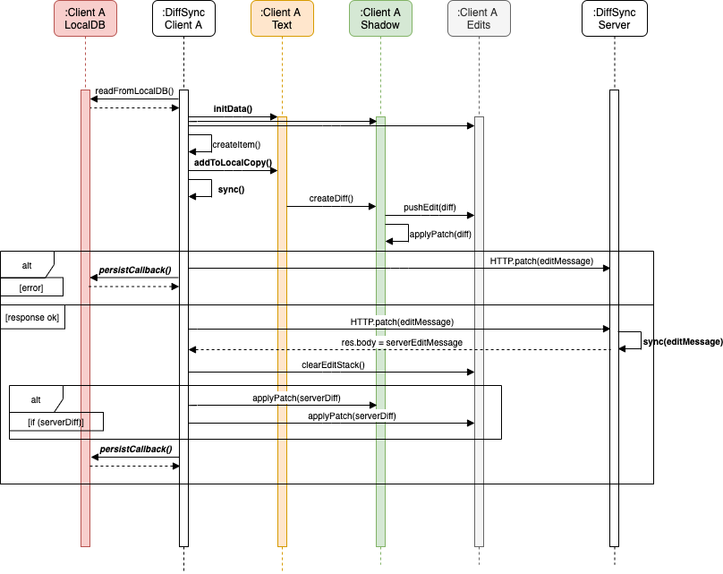
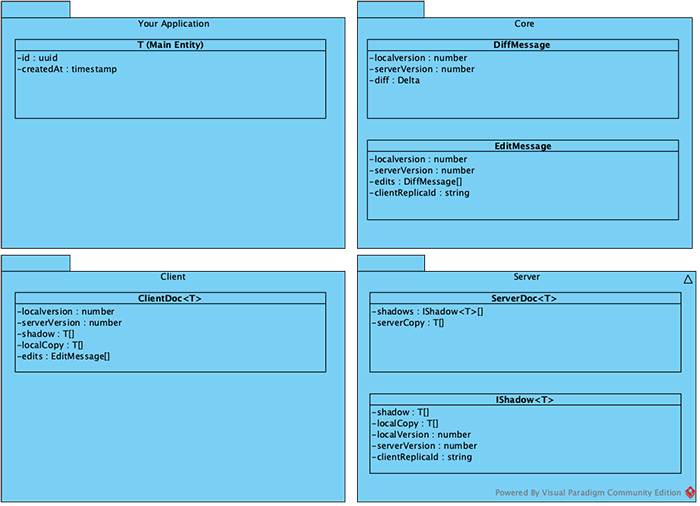

# diff-patch-sync

**diff-patch-sync** is a TypeScript library for syncing collaborative web-applications with REST-backends in order to make them offline-capable. 

Therefore the **Differential Synchronization** Algorithm developed by _[Neil Fraser](https://neil.fraser.name/writing/sync/)_ is being used. It enables synchronization of JSON-Objects using Benjamin Eidelmans _[jsondiffpatch](https://github.com/benjamine/jsondiffpatch)_ implementation (JSON Patch format RFC 6902) with the option to include semantic diffs using _[Google's Unidiff](https://github.com/google/diff-match-patch/wiki/Unidiff)_.

The lightweight API of diff-patch-sync will enable you to easily integrate Http-like **asymmetrical client-server-synchronization** into existing projects. It will help you to develop offline-first apps without changing the projects infrastructure.

## Table of contents

- [Setup](#setup)
- [Demo](#demo)
- [General](#general)
  - [Client Server Synchronization](#client-server-synchronization)
- [Data Model](#data-model)
- [Usage](#usage)
  - [Client](#client)
  - [Server](#server)
- [Tests](#tests)
- [References](#references)
- [Authors](#authors)
- [License](#license)

## Setup

Use npm package manager to install via:

- `$ npm i diff-patch-sync`

or clone repo and run locally:

- `$ npm install && npm run build`

## Demo

See a running demo of a collaborative todo-app containing **Angular 7** frontend and **NestJS** Rest backend on Node.js server: 

**[Demo Todo App](http://todo-app.w11k.de/)**

It is recommended to use two different browsers (e.g. Chrome and Firefox) or two instances of Chrome in _private mode ("Ctrl + Shift + n")_ because IndexedDB is used and the instances should not share the database.

## General

- The core of Differential Synchronization constists of _diffing_ and _patching_ objects.
- The synchronization takes place by sending requests via Http protocol. Keep in mind that the communication is assymetrical and it only syncs if the client requests for it. Though an interval mechanism could be added additionally to poll/sync data more often.
- Data which is transmitted over the network to the REST api consists of an EditsDTO object. It contains an _stack of diffs_ between the changed client's data copy and a shadow of the client's copy, as well as a _unique id_ per replica (client instance) and _version numbers_ respectively for the _local version_ and the _server version_ of the shadow.
- The version numbers are each updated when the sync is successful. There are a few reasons why they could not in sync any more: If the request gets lost the server version number will not be incremented, though the clients knows that the diff has not been applied to the server and he sends the changes in the next sync cycle.
- Only one sync cycle: On slow internet connections it could theoretically occour, that two request are fired before the first roundtrip has been finished. The second request will be prevented and the changes will be send with the next sync cycle because of otherwise the version numbers will get mixed up.


- The concrete Diffferential Synchronization algorithm by Neil Fraser is shown in the figure below.

![Differential Synchronization Algorithm [https://neil.fraser.name/writing/sync]](assets/images/differential_synchronization_guaranteed_delivery.png "Differential Synchronization Algorithm")

Here's how the Client-Server-Synchronization works: 
### Client-Server-Synchronization


1. On initial load the clients data copy and local shadow are empty. 
2. First the client fetches data from server. On the first request a new shadow per client will be created on the server.
3. The response will be the diff between the empty shadow and the servers copy. This returns the whole dataset.
4. The diff will be applied on the clientside.
5. A callback function makes it possible to persist the data locally, each time an error occours during network communication or when the response successfully arrives.
6. Every time making changes on the client and thus changing the local data copy, the diff between the local data copy and the local shadow will be send to the server.
7. Next the patch will be applied to the clients shadow on the server. 
6. Before the servers data copy will be patched with the clients diff as well, a diff between the servers data copy and the will be taken.
8. If the diff is not empty, the changes will be added to the response.
9. A callback function is being offered to persist the client shadow serverside. 
10. Before the sync finishes on the server, the entire changes of the server document during the sync cycle are determined to be able to reflect the changes to the main entity on the servers database. Therefore callback functions are provided to update the servers database.

- The **client** implementation of the algorithm can be seen in the sequence diagram below:
    


- The **server** implementation of the algorithm can be seen in the sequence diagram below:
    
    


## Data Model

_The _ClientDoc_ and the _ServerDoc_ classes represents the data to be persisted respectively clientside and serverside:_



## Usage

### Client

```typescript
import {DiffPatchSyncClient} from "diff-patch-sync/dist/client/src/diff-patch-sync-client";

/*
*    This will create a new client. 
*    
*    @typeparam T                               The type parameter `T` is generic, so pass your own interface/class for type safety.
*    @param clientReplicaId                     The ´clientReplicaId´ parameter is a unique id per replica instance. Each client must contain it. 
*                                               Recommended for that is to pass a generated uuid. This unique id must be permanently persisted on 
*                                               the client-side e.g. in localStorage or IndexedDB.
*    @param syncWithRemoteCallback              The ´syncWithRemoteCallback´ parameter is the callback function for the api call to the rest backend. 
*    @param storeLocalData   The ´storeLocalData´ parameter is an optional callback function to persist the 
*                                               document cliend-side.
*    @param diffPatchOptions                    The ´diffPatchOptions´ parameter is optional and you can pass your own options for the diff patch 
*                                               algorithm (see https://github.com/benjamine/jsondiffpatch#options)
*/
    
const client: DiffPatchSyncClient<Todo> = new DiffPatchSyncClient<Todo>('unique-id-per-replica', syncWithServerCallback);
```

#### Initializing data

```typescript
// The ClientDoc interface helps you to hold the local data copy, the shadow of the data copy and the edits to be send to the server  
import {ClientDoc} from syncWithRemote;

const loadedDoc: ClientDoc<Todo> = { .... };

/*
*    The clients needs to be initialized with the `initData` function with data before usage. Otherwise it will use an empty document.  
*    
*    @param initialData     The ´initialData´ parameter is optional. Either to leave empty on the beginning or to initialize with the persisted data
*/
client.initData(loadedDoc);
```

#### Create data

```typescript
const newTodo: Todo = { title: 'This is a new entry', id: 'new-generated-entry-id' };

/*
*    If you want to add a new entry to your data use `addToLocalCopy` function.
*
*    @param item        The ´docItem´ parameter type should be the same a the type parameter you passed before on creating the client.
*   
*/
client.addToLocalCopy(newTodo);
```

#### Delete data

```typescript
const toBeRemovedItem: Todo = client.getLocalCopy().filter(todo => todo.id === 'to-be-deleted-entry-id').reduce((previousValue, currentValue) => currentValue);

/*
*    If you want to remove an existing entry of the data use `removeFromLocalCopy` function. 
*
*    @param docItem       The `docItem` parameter should be an existing entry from the clients document state.
*   
*/
client.removeFromLocalCopy(toBeRemovedItem);
```

or 
```typescript
const idToBeRemoved: string = 'to-be-deleted-entry-id';

/*
*    If you want to remove an existing entry by id of the data use `removeFromLocalCopyById` function.
*
*    @param id      The `id` parameter should be an id which will be compared to entries in the clients document state.
*   
*/
client.removeFromLocalCopy(idToBeRemoved);
```

#### Update data
```typescript
const toUpdateItem: Todo = client.getLocalCopy().filter(item => item.id === 'to-be-updated-entry-id').reduce((previousValue, currentValue) => currentValue);
const updatedItem = { ...toUpdateItem, title: 'This is an updated entry' };

/*
*    If you want to update an existing entry of the data use `updateLocalCopy` function. 
*
*    @param toUpdateItem    The `toUpdateItem` parameter should be an existing entry from the clients document state.
*    @param updatedItem     The `updatedItem` parameter should be updated entry which will be committed to the clients document state.
*   
*/
client.updateLocalCopy(toUpdateItem, updatedItem);
```
or 

```typescript
const idToBeUpdated: string = 'to-be-updated-entry-id';
const updatedItem = { id: 'to-be-updated-entry-id', title: 'This is an updated entry' };

/*
*    If you want to update an existing entry by id of the data use `removeFromLocalCopy` function. 
*
*    @param id              The `id` parameter should be an existing id from an entry from the clients document state.
*    @param updatedItem     The `updatedItem` parameter should be updated entry which will be committed to the clients document state.
*   
*/
client.updateLocalCopyById(idToBeUpdated, updatedItem);
```

#### Synchronize data

```typescript
/*
*    After the clients document state has changed the changes must be reflected to the clients shadow and be synchronized with the server. 
*    The `sync` function must be called as well on application start to fetch the data with the server.
*    At this point the `syncWithServerCallback` callback which was passed to the client will be called.
*    In order to persist the current clients document state before and after syncing with the backend, the `storeLocalData` will be called if defined. 
*    
*    @returns       Return an observable of the new synced client document state
*/
const syncedDoc: Observable<ClientDoc<Todo>> = client.sync();
```

The callback function `syncWithRemoteCallback` can easily be integrated by implementing `LocalStoreAdapter` interface in your class. 
```typescript
import {EditsDTO} from "diff-patch-sync/dist/core/diff-patch-sync-interfaces";
import {LocalStoreAdapter} from "diff-patch-sync/client/src/diff-patch-sync-interfaces";
/*
*    The ´syncWithRemoteCallback´ function is the callback function for the api call to the rest backend.
*
*    @param editMessage     The `editMessage` parameter contains the version numbers to be compared with the server version numbers, 
*                           the unique id of the replica and the stack of diffs which are not applied on the server yet.
*    @returns               Returns an Observable of an updated editMessage from the server which contains possible server changes. The changes will 
*                           be automatically applied in the sync function.
*/
syncWithRemoteCallback(editMessage: EditsDTO): Observable<EditsDTO> {
    // api call here with with body containing editMessage
    return editMessageFromServer;
}
```

#### Persisting data

To persist the data locally in the client-storage the callback function `storeLocalData` can easily be integrated by implementing `LocalStoreAdapter` interface in your class.

```typescript
/*
*    In order to persist the current clients document state before and after syncing with the backend, the 
*    `storeLocalData` callback function will be called if defined.
*
*    @param document     The `document` parameter contains the hole document with the 
*    clients local data copy, the client data shadow, all version numbers and the unique replica id 
*/ 
storeLocalData(document: ClientDoc<Todo>) {
    // persist data client-side
}
```

### Server

```typescript
import {DiffPatchSyncServer} from "diff-patch-sync/dist/server/src/diff-patch-sync-server";

/*
*    This will create a new server. 
*    
*    @typeparam T                               The type parameter `T` is generic, so pass your own interface/class for type safety.
*    @param saveShadowCallback                  The ´saveShadowCallback´ parameter is the callback function to persist a new clients shadow copy on the servers database 
*    @param updateShadowCallback                The ´updateShadowCallback´ parameter is the callback function to update a clients shadow copy on the servers database
*    @param executeEntityOperation                 The ´executeEntityOperation´ parameter is the callback function which is called after each sync request to delete an affected item from the main entity on the servers database 
*    @param saveOrUpdateItemsCallback           The ´saveOrUpdateItemsCallback´ parameter is the callback function which is called after each sync request to update or save an affected item from the main entity on the servers database 
*    @param diffPatchOptions                    The ´diffPatchOptions´ parameter is optional and you can pass your own options for the diff patch algorithm (see https://github.com/benjamine/jsondiffpatch#options)
*/
    
const server: DiffPatchSyncServer<Todo> = this.server = new DiffPatchSyncServer<Todo>(saveShadowCallback, updateShadowCallback, executeEntityOperation, saveOrUpdateItemsCallback);
```

#### Initializing data

```typescript
/*
*    The server needs to be initialized with the `initData` function with data before usage. Otherwise it will use an empty array of the server copy and client shadows  
*    
*    @param localCopy   The ´localCopy´ parameter is optional. Either to leave empty on the beginning or to initialize with the persisted server copy
*    @param shadows     The ´shadows´ parameter is optional. Either to leave empty on the beginning or to initialize with the persisted client shadows
*/
server.initData(localCopy, shadows);
```

#### Synchronize data

```typescript
import {EditsDTO} from "diff-patch-sync/dist/core/diff-patch-sync-interfaces";
/*
*    After hitting the server endpoint only the `sync` function will be needed.    
*       
*       
*    @param clientEdits     The `clientEdits` parameter is the body from the clients request    
*    @returns               Returns a Promise of a new EditsDTO for the client which contains the version numbers and possible server side changes  
*/
const serverResponse: EditsDTO = this.server.sync(editMessage);
```

#### Persisting data

To persist the data different callback functions can easily be integrated by implementing `PersistenceAdapter` interface in your class.

_Save Shadow:_
```typescript
/*
*    In order to persist a new shadow when a new client connects the `saveShadowCallback` callback function will be called if defined. 
*    
*    @param shadow     The `shadow` parameter contains the clients shadow
*    @returns          Should return a Promise when safed  
*/ 
saveShadowCallback(shadow: Shadow): Promise<any> {
    // safe client shadow here in your repository 
}
```

_Update Shadow:_
```typescript
/*
*    In order to persist an updated shadow when a client synchronizes the `updateShadowCallback` callback function will be called if defined. 
*    
*    @param shadow     The `shadow` parameter contains the clients shadow
*    @returns          Should return a Promise when updated  
*/ 
updateShadowCallback(shadow: Shadow): Promise<any> {
    // update client shadow here in your repository 
}
```

_Save or update main entity entries:_
```typescript
/*
*    In order to update or add new entries to the main entity when the `sync` function is called the `saveOrUpdateItemsCallback` callback function will be called if defined. 
*    
*    @param item       The `item` parameter contains an array of entries of the main entity
*    @returns          Should return a Promise when updated/saved
*/ 
saveOrUpdateItemsCallback(items: Todo[]): Promise<any> {
    // update or save main entity here in your repository 
}
```

_Delete main entity entries:_
```typescript
/*
*    In order to delete an entry from the main entity from the database when the `sync` function is called the `executeEntityOperation` callback function will be called if defined. 
*    
*    @param toDeleteIds       The `toDeleteIds` parameter contains an array of ids of items to be deleted from the main entity
*    @returns                 Should return a Promise when deleted
*/ 
executeEntityOperation(toDeleteIds: string[]): Promise<any> {
    // delete from main entity here in your repository
}
```

## Tests

Running unit tests: 
```bash
$ npm i
$ npm run test
$ npm run coverage
```

## References

* [jsondiffpatch](https://github.com/benjamine/jsondiffpatch) - Diff & patch JavaScript objects.
* [diff-match-patch](https://github.com/google/diff-match-patch) - Diff Match Patch is a high-performance library in multiple languages that manipulates plain text. 
* [lodash](https://github.com/lodash/lodash) - A modern JavaScript utility library delivering modularity, performance, & extras.
* [uuid](https://github.com/uuidjs/uuid) - Generate RFC-compliant UUIDs in JavaScript.

## Authors

* **Mario Sallat** - *diff-patch-sync* - [DiffPatchSyncHttp](https://github.com/msallat)

## License

This project is licensed under the MIT License - see the [LICENSE.md](LICENSE.md) file for details